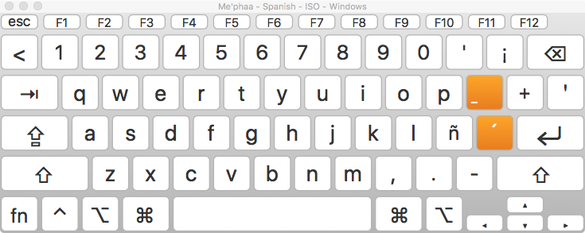
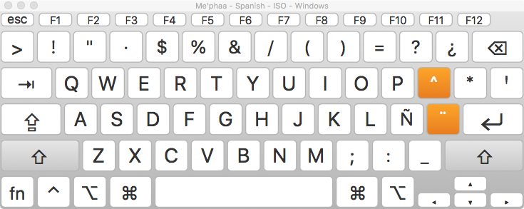
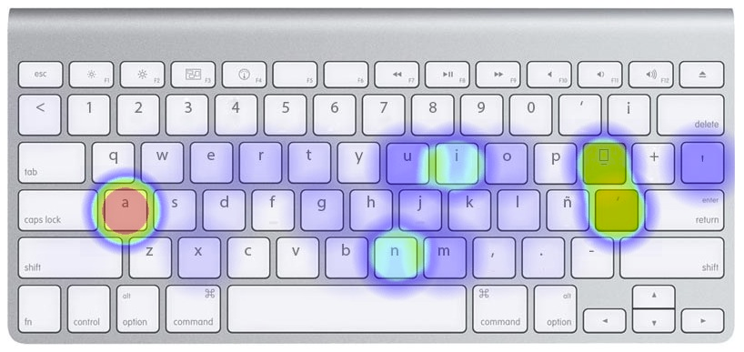
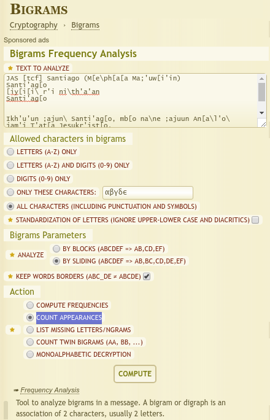
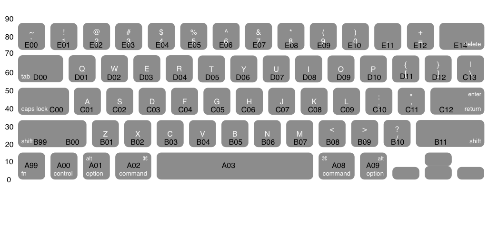
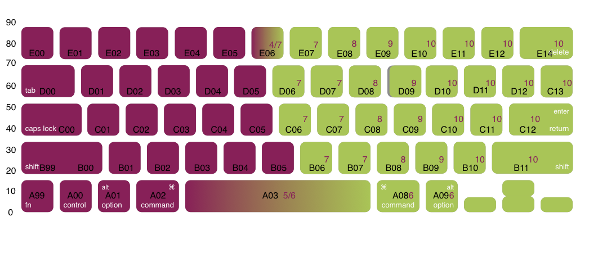

# Mephaa keyboard analysis

**Language**: [tcf]

**Text source**: Mark Weathers

**Text content**: Epistle of James

**Keyboard layout history**: The Spanish Windows ANSI keyboard layout was co-opted with redundant Spanish characters replaced by Maphaa characters. This was done in conjunction with replacing the glyphs in a special font, so that no keyboard setting needed to be changed on the computer. Simply type as normal on a Spanish keyboard and use the Mephaa file.

**Mephaa keyboard layout images**:

---

<center>_Base State_</center>

---

<center>_Shift State_</center>

---


<center>_Mephaa Required Usage_</center>

---

**Text processing steps**:

1. Text received, as `JAS_TCF.txt`
2. Moved characters from hacked font code points to proper Unicode values, using [`Teckit`](https://github.com/silnrsi/teckit). `me'phaa.map` & `me'phaa.tec`
3. Replaced all characters in the Mephaa text with their corresponding values as if they were English characters typed on a QWERTY keyboard. (Done by hand via search and replace.) resulting file: `tcf-on-QWERTY.txt`
<<<<<<< HEAD
 This allows for [`Typing`](https://github.com/michaeldickens/Typing) to process the characters (really in the mental model of typing it is processing keypresses not characters). [`Typing`](https://github.com/michaeldickens/Typing) only processes characters as if they are single byte, so no two or three byte characters work with the program.
5. `tcf-on-QWERTY-UCC.txt` is a quick check to show that all characters in the file are in the single byte range.
6. [`Typing`](https://github.com/michaeldickens/Typing) requires a list of character bigrams and a list of character counts.
 The default method is to use an application by Michael Dickens called [`Frequency`](https://github.com/michaeldickens/Frequency). - Hugh has had some difficulty in getting that to compile. So in lieu of using that Hugh started down the path of step _Seven_.
  [`Typing`](https://github.com/michaeldickens/Typing) assumes that there is a one to one correspondence between each single byte character and each keystroke. Processes in step three ensure that all all multi-byte characters are converted to single byte characters and their corresponding positions. This can allow [`Typing`](https://github.com/michaeldickens/Typing) to give us a fitness value (by running the tests against the existing QWERTY setting), it can also allow [`Typing`](https://github.com/michaeldickens/Typing) to make a projection about how to organize a keyboard layout based on [`Typing`](https://github.com/michaeldickens/Typing)'s simulated annealing algorithm.
7. To create bigrams and character count the following scripts were used:
=======
 This allows for [`Typing`](https://github.com/michaeldickens/Typing) to process the characters (really in the mental model of typing it is processing keypresses not characters). [`Typing`](https://github.com/michaeldickens/Typing) only processes characters as if they are single byte, so no two or three byte characters work with the program. However this means that if a language corpus is convertedd from their orthographical representation it can be re-rendered as a keypress representation. This keypress representation can just so happen to have QWERTY codepoints - the result is not English, rather some language as goblety gook. Another way to think about this would be to use ISO 9995 names of keys.
4. `tcf-on-QWERTY-UCC.txt` is a quick check to show that all characters in the file are in the single byte range.
5. [`Typing`](https://github.com/michaeldickens/Typing) requires a list of character bigrams and a list of character counts.
 The default method is to use an application by Michael Dickens called [`Frequency`](https://github.com/michaeldickens/Frequency). - Hugh has had some difficulty in getting that to compile. So in lieu of using that Hugh started down the path of step _Six_.
 [`Typing`](https://github.com/michaeldickens/Typing) assumes that there is a one to one correspondence between each single byte character and each keystroke. Processes in step three ensure that all all multi-byte characters are converted to single byte characters and their corresponding positions. This can allow [`Typing`](https://github.com/michaeldickens/Typing) to give us a fitness value (by running the tests against the existing QWERTY setting), it can also allow [`Typing`](https://github.com/michaeldickens/Typing) to make a projection about how to organize a keyboard layout based on [`Typing`](https://github.com/michaeldickens/Typing)'s simulated annealing algorithm.
6. To create bigrams and character count the following scripts were used:
>>>>>>> 0fe6f83b0fcf687faa0953f2b85834845d422d42

  ```
./bigrams.py tcf-on-QWERTY.txt > allDigrams.txt
 ```
 Then to get the character counts.
  ```
 UnicodeCCount.pl -n tcf-on-QWERTY.txt | cut  -f 2,3 | tr "\t" " " > all
 Characters.txt && sed -i '1d' allCharacters.txt
 ```

 Then the character for new line had to be added to the top line as `\n`.

<!-- 7. To create bigrams the service at the following website was used: https://www.dcode.fr/bigrams. The following settings were also used:
   *  ALL CHARACTERS (INCLUDING PUNCTUATION AND SYMBOLS)
   * STANDARDIZATION OF LETTERS (IGNORE UPPER-LOWER CASE AND DIACRITICS) [un-checked]
   * Analyze BY SLIDING (ABCDEF => AB,BC,CD,DE,EF)
   * KEEP WORDS BORDERS (ABC_DE ≠ ABCDE) [checked]
   * COUNT APPEARANCES


 <center>  </center>


  The website produces a down-loadable `.csv` file `tcf-on-QWERTY-bigram-count-ori.csv`. Some editing of this CSV file is necessary to convert it into the same format of bigram file that [`Typing`](https://github.com/michaeldickens/Typing) expects (`\n` for new line, `\\` for `\`, `\t` for TAB, and only a space between the character column and the count column). -->

---
 
<center>_Keyboard ISO 9995 Key numbers on an ANSI QWERTY keyboard_</center>

---
 
<center>_Keyboard Handedness shown with ISO 9995 Key numbers on an ANSI QWERTY keyboard_</center>

---
