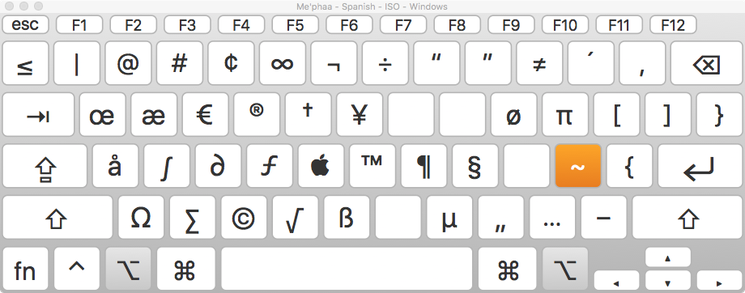
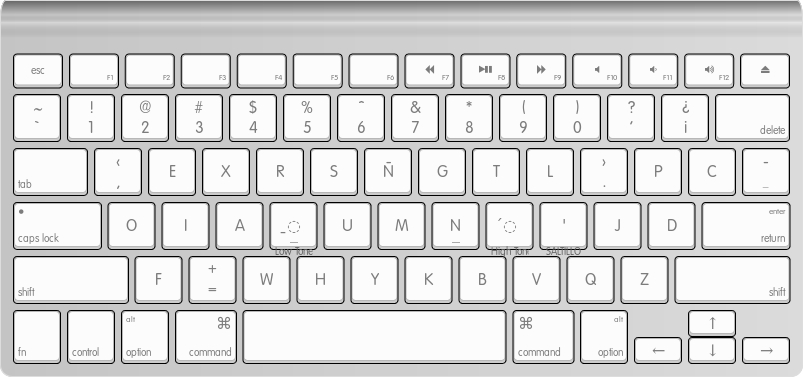
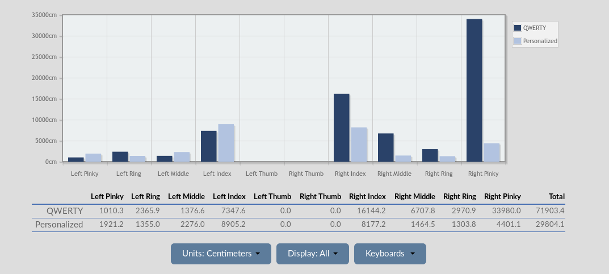
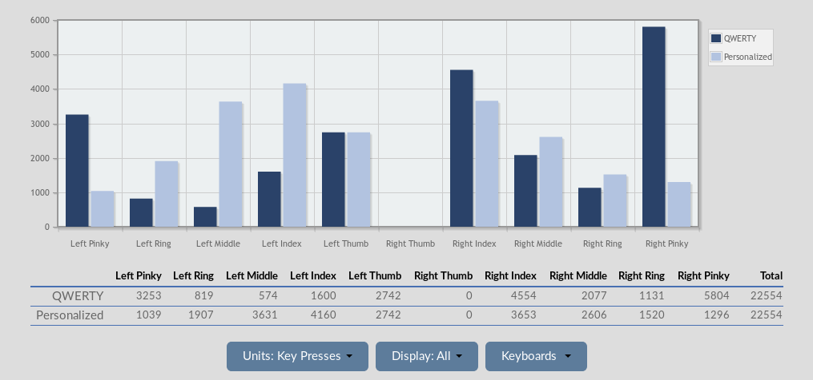
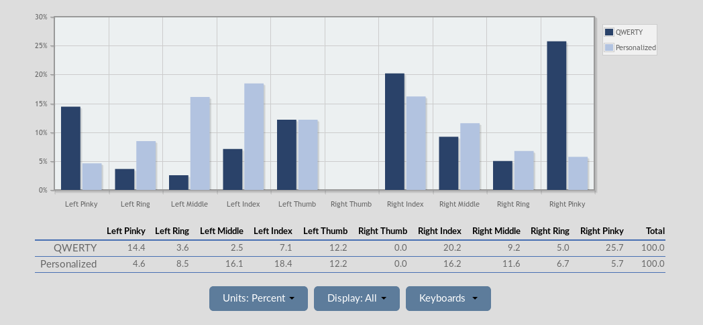
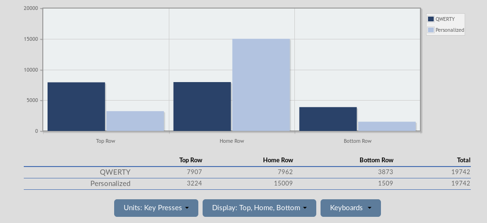

# Mephaa keyboard analysis

**Language**: [tcf]

**Text source**: Mark Weathers

**Text content**: Epistle of James

**Keyboard layout history**: The Spanish Windows ANSI keyboard layout was co-opted with redundant Spanish characters replaced by Maphaa characters. This was done in conjunction with replacing the glyphs in a special font, so that no keyboard setting needed to be changed on the computer. Simply type as normal on a Spanish keyboard and use the Mephaa file.

**Mephaa keyboard layout images**:

---


_Base State_

---


_Shift State_

---



_Alt State_

---


_Mephaa Required Usage_

---

**Text processing steps**:

1. Text received, as `JAS_TCF.txt`
2. Moved characters from hacked font code points to proper Unicode values, using [`Teckit`](https://github.com/silnrsi/teckit). `me'phaa.map` & `me'phaa.tec`
3. Scripture texts has a very formal typesetting process. Things like paragraph, book, chapter, and verse markers: these are indicated by a reverse solidus `\`. All of these are removed (by hand).
4. Replaced all characters in the Mephaa text with their corresponding values as if they were English characters typed on a QWERTY keyboard. (Done by hand via search and replace.) resulting file: `tcf-on-QWERTY.txt`
 This allows for [`Typing`](https://github.com/michaeldickens/Typing) to process the characters (really in the mental model of typing it is processing keypresses not characters). [`Typing`](https://github.com/michaeldickens/Typing) only processes characters as if they are single byte, so no two or three byte characters work with the program. However this means that if a language corpus is converted from their orthographical representation it can be re-rendered as a keypress representation. This keypress representation can just so happen to have QWERTY codepoints - the result is not English, rather some language as goblety gook. Another way to think about this would be to use ISO 9995 names of keys.
5. `tcf-on-QWERTY-UCC.txt` is a quick check to show that all characters in the file are in the single byte range.
6. [`Typing`](https://github.com/michaeldickens/Typing) requires a list of character bigrams and a list of character counts.
 The default method is to use an application by Michael Dickens called [`Frequency`](https://github.com/michaeldickens/Frequency). - Hugh has had some difficulty in getting that to compile. So in lieu of using that Hugh started down the path of step _Seven_.
 [`Typing`](https://github.com/michaeldickens/Typing) assumes that there is a one to one correspondence between each single byte character and each keystroke. Processes in step three ensure that all all multi-byte characters are converted to single byte characters and their corresponding positions. This can allow [`Typing`](https://github.com/michaeldickens/Typing) to give us a fitness value (by running the tests against the existing QWERTY setting), it can also allow [`Typing`](https://github.com/michaeldickens/Typing) to make a projection about how to organize a keyboard layout based on [`Typing`](https://github.com/michaeldickens/Typing)'s simulated annealing algorithm.
7. To create bigrams and character count the following scripts were used:

  ```
./bigrams.py tcf-on-QWERTY.txt > allDigrams.txt
 ```
 Then to get the character counts.
  ```
 UnicodeCCount.pl -n tcf-on-QWERTY.txt | cut  -f 2,3 | tr "\t" " " > all
 Characters.txt && sed -i '1d' allCharacters.txt
 ```

 Then the character for new line had to be added to the top line as `\n`.

8. Eventually just KLA was used with the text from `tcf-on-QWERTY.txt`. This text was then re-encoded back to Mephaa and an image created via [KLE](http://www.keyboard-layout-editor.com/#/gists/12b42baca7030bfabea5181833232e2b ). The analysis of KLA is presented below.

<!-- 7. To create bigrams the service at the following website was used: https://www.dcode.fr/bigrams. The following settings were also used:
   *  ALL CHARACTERS (INCLUDING PUNCTUATION AND SYMBOLS)
   * STANDARDIZATION OF LETTERS (IGNORE UPPER-LOWER CASE AND DIACRITICS) [un-checked]
   * Analyze BY SLIDING (ABCDEF => AB,BC,CD,DE,EF)
   * KEEP WORDS BORDERS (ABC_DE ≠ ABCDE) [checked]
   * COUNT APPEARANCES


  


  The website produces a down-loadable `.csv` file `tcf-on-QWERTY-bigram-count-ori.csv`. Some editing of this CSV file is necessary to convert it into the same format of bigram file that [`Typing`](https://github.com/michaeldickens/Typing) expects (`\n` for new line, `\\` for `\`, `\t` for TAB, and only a space between the character column and the count column). -->

## Keyboard Layout Analysis
**Statistical analysis of exiting and optimized Mephaa keyboard using Keyboard Layout Analyzer (KLA)**

Using the text transformation methods outlined above the following keyboard statistics become available when using [KLA](http://patorjk.com/keyboard-layout-analyzer/#/main).

KLA also suggests an "optimized" keyboard, and is the reference keyboard layout in the following graphs. This is contrasted with the existing Mephaa keyboard which is shown above. In the diagrams the KLA optimized keyboard is referenced as _Personalized_ while the existing Mephaa layout is labeled _QWERTY_. It should be noted that the KLA optimization engine acknowledges that it is not a very aggressive optimization.  One place or issue that Hugh notices is where further optimization could be considered is that both tone marks could be moved to the right hand so that a better cadence can be achieved. As the tone marks currently are situated a high level of outward rolls exist.  



The distance that the typists' fingers will need to travel is greater for the exiting Mephaa layout.



As the previous heat map for the existing Mephaa keyboard shows, the frequently used keys are on the periphery of the typing area, significantly overloading the weaker fingers. In actual typing of Mephaa, Hugh has observed this to contribute to hunt-and-peck style typing.



In terms of work load percentages we can see where on the hand the two keyboards are "balancing" the workload.



Finally in terms of row usage we can see where the high frequency targets are.



---

 

_Keyboard ISO 9995 Key numbers on an ANSI QWERTY keyboard_

---

 

_Keyboard Handedness shown with ISO 9995 Key numbers on an ANSI QWERTY keyboard_

---

<!-- Link to keyboard file:  http://www.keyboard-layout-editor.com/#/gists/12b42baca7030bfabea5181833232e2b -->
